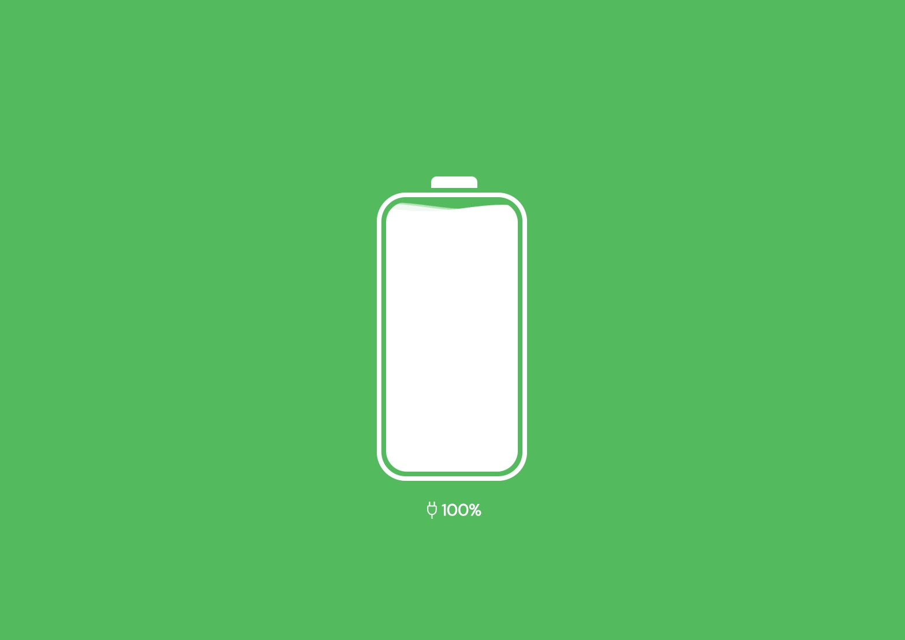

# Wave Rect Demo

这是一个使用Vue.js和CSS编写的Wave样式例子，通过预览网址可以查看效果。该项目具有以下功能：
This is an example of a wave-style component written using Vue.js and CSS. You can see the effect by visiting the preview URL. The project offers the following functionalities:

## Features

- 动画效果的波浪：通过精心设计的动画效果，呈现出生动的波浪动态效果。
- Animated waves: The carefully designed animation creates a dynamic wave effect.

- 可调整高度的百分比：根据所设定的百分比，可以自由调整波浪的高度，使其适应不同的需求。
- Adjustable height based on percentage: You can adjust the height of the wave based on a specified percentage, allowing it to fit various requirements.

- 简洁明了的Vue.js代码：项目使用Vue.js框架编写，代码简洁易懂。这意味着您可以将这段代码轻松迁移至其他任何框架，以满足您的项目需求。
- Clean and concise Vue.js code: The project is written using Vue.js framework, and the code is clean and easy to understand. This means you can easily migrate this code to any other framework to meet your project needs.

### GitHub Template

[Create a repo from this template on GitHub](https://github.com/lanseria/arco-uno-basic-template/generate).
